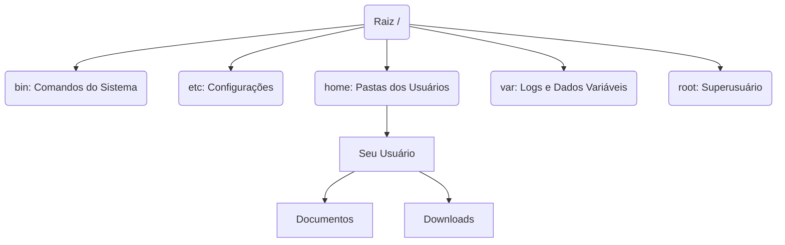

# Módulo 1: O Despertar do Pinguim 🐧

## 1. História e Filosofia
* **Origem:** Criado por Linus Torvalds em 1991.
* **GPL:** A licença que garante que o código permaneça livre.
* **Distros:** Debian (estabilidade), Ubuntu (facilidade), CentOS/RHEL (servidores).

## 2. O Processo de Boot e o Kernel
* **Kernel:** O coração que gerencia hardware.
* **GRUB:** Menu que carrega o Kernel e permite recuperação do sistema.


```
+-------------------------------------------------------+

|                 USUÁRIO (Você / Apps)                 |
|       "Quero abrir um arquivo ou navegar na web"      |
+-------------------------------------------------------+

           |                                ^
           v                                |
+-------------------------------------------------------+

|                SHELL (Bash / Terminal)                |
|         "Traduz seus comandos para o Kernel"          |
+-------------------------------------------------------+

           |                                ^
           v                                |
+-------------------------------------------------------+

|                KERNEL (O Coração / Motor)             |
|        "Gerencia CPU, Memória e os Discos"            |
+-------------------------------------------------------+

           |                                ^
           v                                |
+-------------------------------------------------------+

|                HARDWARE (A Máquina Real)              |
|          "Processador, RAM, Placa de Vídeo"           |
+-------------------------------------------------------+
```

## 3. Estrutura de Diretórios (FHS)
* `/` : Raiz (onde tudo começa).
* `/etc` : Arquivos de configuração.
* `/home` : Pastas dos usuários.
* `/root` : Pasta do superusuário.
* `/var/log` : Onde o sistema "fofoca" o que está acontecendo (logs).



## 4. Comandos Essenciais

| Comando | Descrição |
|---------|-----------|
| `pwd`   | Mostra onde você está |
| `ls -la`| Lista arquivos (incluindo ocultos) |
| `cd`    | Navega entre pastas |
| `mkdir` | Criar diretórios |
| `mv`    | Renomear e mover arquivos ou diretórios |
| `rm`    | Remove diretórios |
| `sudo`  | Executa como administrador |
| `apt install` | Instala novos softwares (em Debian/Ubuntu) |

## 5. Manipulação de Dados (O que falta para fechar 4h)
* `>` : Salva a saída em um arquivo (sobrescreve).
* `>>` : Adiciona a saída ao final de um arquivo.
* `|` (Pipe): Usa o resultado de um comando como entrada para outro.

## 6. Gerenciamento de Pacotes (`apt`)
O `apt` (Advanced Package Tool) é o instalador do Debian/Ubuntu.
* `sudo apt update`: Atualiza a lista de repositórios.
* `sudo apt install <pacote>`: Instala um programa.
* `sudo apt remove <pacote>`: Remove um programa.

## 7. Editores de Texto e Monitoramento
* **Nano**: Editor simples dentro do terminal. (Usa `Ctrl+O` para salvar e `Ctrl+X` para sair).
* **Htop**: Versão moderna e colorida do gerenciador de tarefas (monitor de processos).

## 8. Encadeamento e Filtros
* `|` (Pipe): Pega a saída de um comando e joga para outro.
* `grep`: Filtra textos e palavras específicas.
* Exemplo: `ls /etc | grep "net"` (Lista apenas arquivos em /etc que tenham "net" no nome).
